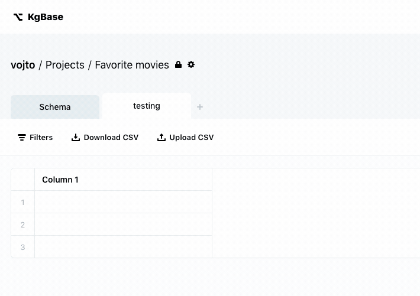

# React Tour

_Simple, interactive tour component for React._


[](https://github.com/prettier/prettier)

## About

React Tour helps you add an interactive tour to your product. **It waits for user to complete certain action** before showing the next tooltip. Optionally, you can opt into interaction simulation - so user doesn't have to do anything, only watch.



# Installation

Use npm:

`npm install @thinknum/react-tour`

Or Yarn:

`yarn add @thinknum/react-tour`.

**Note: React Tour currently requires `react-redux` at version 6, as it relies on custom stores using store key. (See [this issue](https://github.com/reduxjs/react-redux/issues/1132) in react-redux.) We're working on resolving this, pull-requests are welcome.**


# Adding tour to your project

### 1. Wrap your app in `ReactTourProvider`

It's just a custom Redux provider where tour is storing its state. This will let you integrate user interactions with the tour, for example waiting for user to take an action before showing the next tooltip.

```ts
// components/MyApp.tsx
const MyApp = () => {
  return (
    <ReactTourProvider>
      <ReduxProvider store={store}>
        <AppLayout />
      </ReduxProvider>
    </ReactTourProvider>
  );
};
```

### 2. Create a `TourContainer` component

It will take care of rendering the tour, and it will be a place to put all tour-related code. For now, we'll keep it empty, but we'll come back to it and add code.

```ts
// components/TourContainer.tsx
const TourContainer = () => {
  return null; // For now, just return null.
};
```

Don't forget to render this component somewhere in your app layout:

```ts
// components/AppLayout.tsx
const AppLayout = () => {
  return (
    <>
      <Sidebar />
      <Main />

      <TourContainer />
    </>
  );
}
```

### 3. Add an enum with your element IDs

You'll store all element IDs (used by tour) in one place - to prevent typos. Add this at top of your tour container:

```ts
// components/TourContainer.tsx
export enum TourElementIds {
  PROJECTS_LIST = "ProjectsList",
  PROJECTS_TITLE = "ProjectsTitle",
  CREATE_PROJECT_BUTTON = "CreateProjectButton",
}
```

In this example, we're gonna pretend there is a title and a button, and we'll want to show tooltips next to these elements.

### 4. Use your newly-added element IDs in your app

Reference the new element IDs in your real UI:

```ts
// components/ProjectsList.tsx
export const ProjectsList = () => {
  return (
    <div id={TourElementIds.PROJECTS_LIST}>
      <h2 id={TourElementIds.PROJECTS_TITLE}>Projects list</h2>

      <button id={TourElementIds.CREATE_PROJECT_BUTTON}>Create new project</button>

      <ul>
        {/* ... */}
      </ul>
    </div>
  );
};
```

### 5. Add the first story to your tour

Now it's time to create the first story. Each story is a sequence of steps explaining a different use case. In this case, we'll create a story called `projectsStory`, which won't do anything, only say hi to user.

Add this to your `TourContainer`:

```ts
// components/TourContainer.tsx

import {ReactStory, TourModalPosition} from "@thinknum/react-tour";

const projectsStory: ReactStory = {
  // Tour will only show once `starterElement` is added to DOM.
  starterElement: "#" + TourElementIds.PROJECTS_LIST,
  steps: [{
    target: "#" + TourElementIds.PROJECTS_TITLE,
    title: "Welcome to Projects List!",
    titleEmoji: "👋",
    content: "Would you like to learn how to use this UI?",
    position: TourModalPosition.RIGHT_CENTER,
    // By setting this to true, the tour won't wait for user to interact with your
    // UI. In the next step, we'll learn how to wait for interaction.
    canProceedWithoutInteraction: true,
  }]
};
```

This story waits for `PROJETS_LIST` element to get mounted, and once it does, it shows a welcome message next to `PROJETS_TITLE` element.

### 6. Create interaction keys enum

Just like we added enum for element IDs, we'll add an enum that will hold all possible interactions in the UI that could affect the tour.

In this example, we'll add interaction called `PROJECT_CREATED` that will be fired each time user creates a new project:

```ts
// components/TourContainer.tsx
export enum TourInteractionKeys {
  PROJECT_CREATED = "ProjectCreated",
}
```

### 7. Fire interactions from the UI

Now we need to make sure the tour gets notified each time user performs one of the interactions specified above. To do that, we'll wrap our component with the `withTourActionsDispatcher` HOC, and then we'll call function `actionStarted` each time user performs the interaction.

```ts
// components/ProjectsList.tsx
import {withTourActionsDispatcher, ITourActionsHandlers} from "@thinknum/react-tour";
import {TourInteractionKeys} from "components/TourContainer";

type TemplateProps = ITourActionsHandlers;

const Template: React.SFC<TemplateProps> = (props) => {
  return (
    <div id={TourElementIds.PROJECTS_LIST}>
      <h2 id={TourElementIds.PROJECTS_TITLE}>Projects list</h2>

      <button
        id={TourElementIds.CREATE_PROJECT_BUTTON}
        onClick={() => {
          // Call real handler here - create the project
          props.actionStarted(TourInteractionKeys.PROJECT_CREATED);
        }}
      >
        Create new project
      </button>

      <ul>
        {/* ... */}
      </ul>
    </div>
  );
};

export const ProjectsList = withTourActionsDispatcher(Template);
```

Calling `actionStarted` won't do anything yet. We'll have to handle it in our story.

### 8. Adding story that waits for interaction

Let's now update the story we have. Let's **prompt the user to click the button**, and once they click it, let's **show a "good job" message**. To do this, we'll add 2 new steps to our existing story:

```ts
// components/TourContainer.tsx

const projectsStory: ReactStory = {
  starterElement: "#" + TourElementIds.PROJECTS_LIST,
  steps: [{
    /* ... welcome step we added previously ... */
  }, {
    target: "#" + TourElementIds.CREATE_PROJECT_BUTTON,
    title: "Create your first project",
    titleEmoji: "✍️",
    content: "Click on the button to create your first project",
    position: TourModalPosition.RIGHT_CENTER,
    // Notice we changed this to false
    canProceedWithoutInteraction: false,
    // If your interaction is more than just 1 step, you can add
    // `interactionStartKey` and `interactionEndKey`
    // On start, the tooltip will hide, and on end, it will show
    // again with the next step.
    interactionStartKey: TourInteractionKeys.PROJECT_CREATED,
    interactionEndKey: TourInteractionKeys.PROJECT_CREATED,
  }, {
    target: "#" + TourElementIds.CREATE_PROJECT_BUTTON,
    title: "Good job",
    titleEmoji: "🤘",
    content: "You just created your first project!",
    position: TourModalPosition.RIGHT_CENTER,
    // We set this to true again, and the tour will end here.
    canProceedWithoutInteraction: true,
  }]
};
```

### 9. Wrapping up

Once you've created your first story, it should be easy to continue and add more. Use `interactionStartKey` and `interactionEndKey` to make those tooltips shows up exactly at the right time during user interaction.

# Credits

React Tour was created to help with user onboarding in [Thinknum](https://thinknum.com), the leading provider of alternative financial data. It is also used in [KgBase](https://kgbase.com), the collaborative, versioned knowledge graph database.

Contributors:

- Lukas Prokein - code
- Philip Litassy - graphic design
- Vojtech Rinik - documentation

# Contributing

We don't have an official guide to contributing yet, but all PRs are welcome.